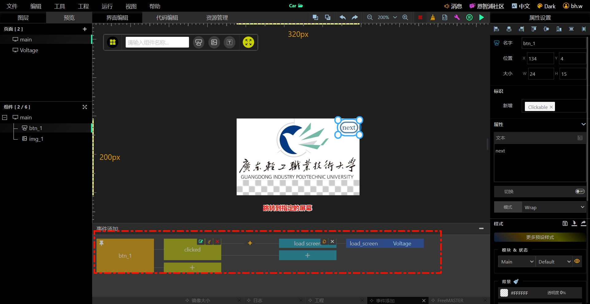
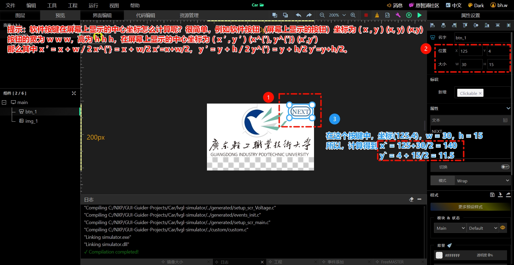
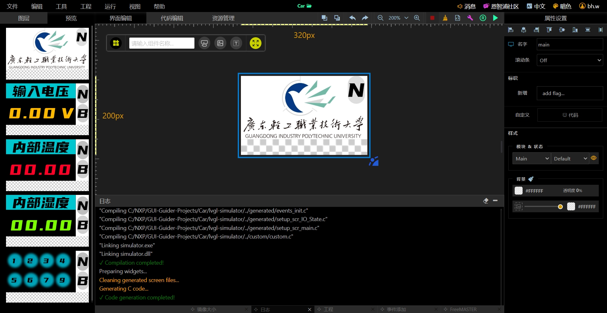

# Car_F4

## 驱动函数介绍

### LCD 的函数

使用的屏幕驱动芯片是 ST7735S，使用 I2C 接口。主要的驱动文件在这两个文件中：

> "Car_F4\Car_F427\BSP\ST7735S\st7735s.c"  
> "Car_F4\Car_F427\BSP\ST7735S\st7735s.h"

### 按键驱动

驱动来源 `https://github.com/0x1abin/MultiButton`

使用的详细教程，参考博客

> > [多按键驱动](<[https://blog.csdn.net/zhang062061/article/details/124358360](https://blog.csdn.net/zhang062061/article/details/124358360)>)

我创建了一个结构体存放按键状态，以供 LVGL 使用

```C
button_status.button2_status = 1; // 按键2单击状态设置为1
```

### LVGL 的函数

版本：8.3.11

LVGL 是一个开源的图形库，用于在嵌入式设备上创建用户界面。它提供了一组函数，用于创建和操作图形元素，如按钮、滑块、标签等。以下是一些常用的 LVGL 函数：

我是用的 NXP 的 GUI Guider 工具，生成了代码，然后把代码复制到项目中。具体使用不记录了

#### 要将按键绑定到 LVGL 的按钮上

Button 属于独立按键而 KeyPad 属于组合按键。

参考博客：

> > [LVGL-GUI Guider 按键绑定](<[https://blog.csdn.net/chenaiguo0503/article/details/131287451](https://blog.csdn.net/chenaiguo0503/article/details/131287451)>)

在文件 lv_port_indev.c 中添加如下代码：

```c
static int8_t button_get_pressed_id(void)
{


    if (button_status.button1_status == 1)
    {
        return 0;
    }
    else if (button_status.button2_status == 1)
    {
        return 1;
    }


    #if 0

    uint8_t i;

    /*Check to buttons see which is being pressed (assume there are 2 buttons)*/
    for(i = 0; i < 2; i++) {
        /*Return the pressed button's ID*/
        if(button_is_pressed(i)) {
            return i;
        }
    }

    #endif

    /*No button pressed*/
    return -1;
}
```

这个的前提是要包含`button_config.h`头文件，并初始化`button_status`结构体。
这个函数首先检查`button_status`结构体的`button1_status`成员变量，如果为 1，则返回 0，表示第一个按钮被按下。如果`button_status`结构体的`button2_status`成员变量为 1，则返回 1，表示第二个按钮被按下。

#### 创建按钮控件

教程：

> [创建按钮控件](<[text](https://blog.csdn.net/m0_55986987/article/details/133032918)>)

对教程的补充：版本变化了，所以位置变化了

设置完如图所示：



在 LVGL 中，物理按键对接软件的按键，可参考这个教程：

> [LVGL 物理按键对接软件按键](<[https://blog.csdn.net/m0_55986987/article/details/133032918](https://blog.csdn.net/jf_52001760/article/details/123065523)>)

将按键的按下坐标对应软件坐标的中间坐标

如图所示计算：



因此，按照这个计算得出两个实体按键对应的坐标，在接着改变程序。在 LVGL 中，按键的坐标设置如下：

在 lv_port_indev.c 中修改：

```c
    /*Assign buttons to points on the screen*/
    static const lv_point_t btn_points[2] = {
        {140, 11.5},   /*Button 1 -> x:140; y:11.5*/
        {140, 65.5},  /*Button 2 -> x:140; y:65.5*/
    };
```

不要忘记初始化这外设输入！！！！！！！！！！！！！！！！！！！！！！！！！！！！！！！！！！！！！！！！！！！！！！

#### 效果

看这个图片


#### 时钟模块

参考博客：
[LVGL 时钟模块]([<\[https://blog.csdn.net/m0_55986987/article/details/133032918\](https://blog.csdn.net/jf_52001760/article/details/123065523)>](https://blog.csdn.net/qq_48211392/article/details/145586269))

这个软件生成的，要自己在去安装目录添加
路径是：
> "D:\Program Files\NXP\GUI-Guider-1.9.1-GA\environment\template\project\v8\lvgl\src\extra\widgets\dclock"

将这个两个文件在工程中包含。注意，再将lv_dclock.h加入到lvgl.h文件夹下
